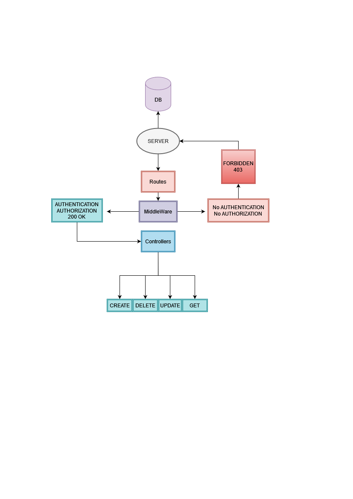
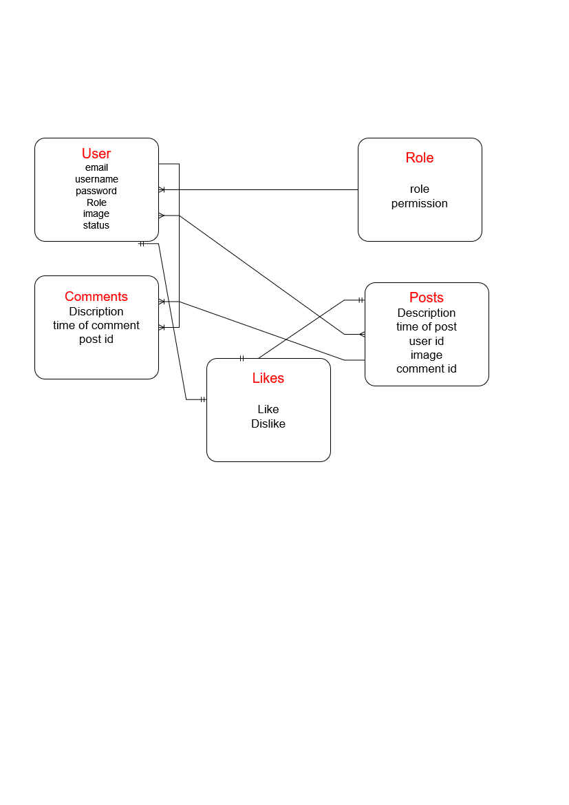

#  *<= backend social Media =>*
### packages => express , dotenv , jsonwebtoken , mongoose, morgan,bcrypt and more
## features
### create users registration, add Posts , comments and likes to posts and comments authenticated user can add comment && likes , posts also the user can delete and update their own post 
### =====> Also there only admins with full control access , with autherization to all controllers , in addition to that there is only one SuperUser or root whatever u named 
## Routes and Controllers
### For users Register , Login and for admins delete users registration
 ### For posts and comments add and delete and get
## => UML

## ERD
